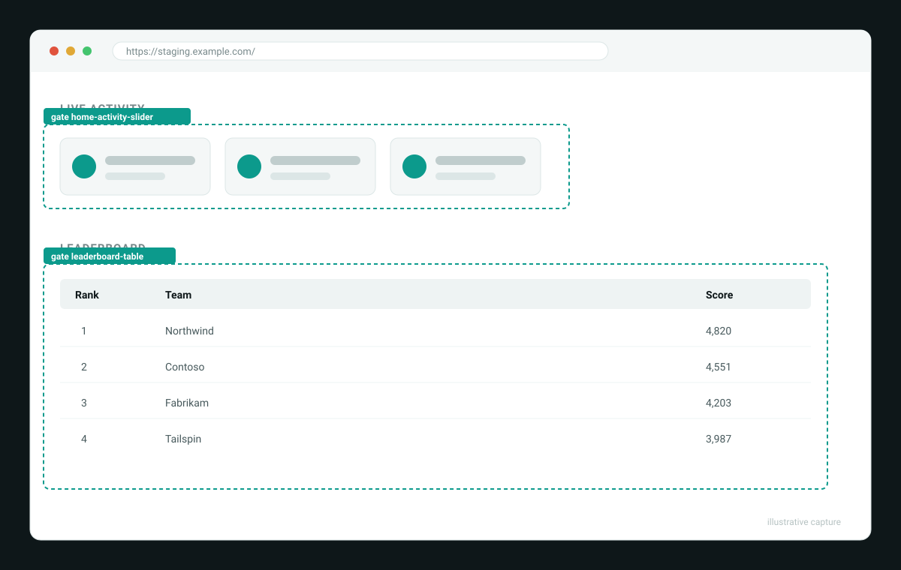
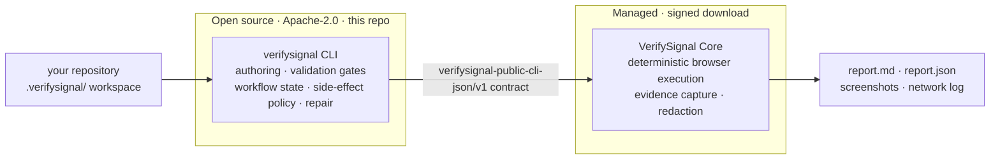

<p align="center">
  
</p>

<h1 align="center">VerifySignal</h1>

<p align="center"><b>AI writes the validation. A deterministic runtime proves it.</b></p>

<p align="center">
  <a href="#quickstart">Quickstart</a> ·
  <a href="#how-it-works">How it works</a> ·
  <a href="examples/">Evidence</a> ·
  <a href="#open-core">Open-core</a> ·
  <a href="#documentation">Docs</a>
</p>

<p align="center">
  <a href="https://github.com/RigelRise/verifysignal-spec/actions/workflows/ci.yml"></a>
  <a href="https://pypi.org/project/verifysignal-spec/"></a>
  
  <a href="LICENSE"></a>
</p>

---

VerifySignal turns product flows — login, checkout, onboarding — into approved,
repeatable browser validations with evidence, starting from your repository.
Your coding agent (Claude Code or Codex) authors and repairs the validation; the
VerifySignal runtime executes it deterministically and leaves an auditable
evidence trail. **There is no AI at execution time:** pass/fail comes only from
validated, explicit instructions.

This repository is the open-source half of VerifySignal (Apache-2.0): the
`verifysignal` CLI, the project-local `.verifysignal/` workspace, and the agent
skills. The execution engine (VerifySignal Core) is a signed package the CLI
downloads and caches automatically on first run — a free email unlock, no account
and no separate install.

## The problem

AI-assisted development ships changes faster than anyone can manually recheck the
flows they touch. The existing answers trade away either speed or trust:
hand-written browser suites become a maintenance backlog, and an AI agent
clicking around your app gives you speed without stable, reviewable proof. **An
AI clicking through your app is a demo, not a test.**

VerifySignal splits the work by what each side is good at:

- **Agents author, humans approve.** Your coding agent drafts use cases, grounds
  selectors against the live DOM, and proposes repairs — through contract-driven,
  staged commands with explicit escalation stops.
- **Execution is deterministic.** Runs execute a fixed, validated action set with
  no inference, so a green result means the same thing every time.
- **Evidence over green checkmarks.** Every run produces a structured report,
  screenshots, and a network log — proof you can review, share, and audit.
- **Side-effect safety.** Write flows require declared side-effect policies, are
  observed at runtime, and gate reruns on previous outcomes — so a validation
  never silently mutates data it should not.

## See a real run

Every run leaves a reviewable evidence bundle behind. The [`examples/`](examples/)
directory ships two, committed **with their evidence**:

<p align="center">
  
</p>

- 📄 [`home-page-unauth/report.md`](examples/home-page-unauth/report.md) — the
  golden-path first run (read-only), proven gate by gate.
- 🔒 [`checkout-write/report.md`](examples/checkout-write/report.md) — a write
  flow with a declared side-effect policy and a captured order URL.

> A short terminal demo GIF is generated from
> [`docs/assets/demo.tape`](docs/assets/demo.tape) — see [`docs/assets`](docs/assets/).

## Quickstart

You will need:

- [uv](https://docs.astral.sh/uv/) (or pipx) and Python 3.11+
- Node.js 24+ (runs the downloaded runtime)
- Playwright Chromium (`npx playwright install chromium` if you do not have it)
- A valid email for the free runtime unlock — no account required

Three ways in, by who you are:

### 1 · Just try it

```sh
uv tool install verifysignal-spec
verifysignal --version
```

(With pipx: `pipx install verifysignal-spec`.) Then initialize a workspace.
`init` asks for your email, sends a free unlock code, downloads the runtime once,
and caches it under `~/.cache/verifysignal/` — outside your project:

```sh
cd your-project
verifysignal init --here --integration claude   # or: --integration codex
verifysignal check
```

### 2 · Wire it into your agent

`init` installs VerifySignal skills into Claude Code or Codex. Run the whole flow
with one command:

```text
/verifysignal "Validate that a user can sign in against https://staging.example.com"
```

The agent drafts the use case from your source, grounds its selectors against the
live app, validates, runs, and repairs — stopping only for real unknowns, missing
credentials, or write side-effects. If the flow needs credentials, export them as
environment variables before the run (for example `QA_USER` / `QA_PASSWORD`);
VerifySignal reads them at run time and never writes them to disk. You can also
drive the stages yourself:

```text
/verifysignal-understand
/verifysignal-specify login "Validate that a QA user can sign in."
/verifysignal-plan login
/verifysignal-implement login
/verifysignal-validate login
/verifysignal-run login
/verifysignal-repair login
```

### 3 · Develop the CLI

You do **not** need the proprietary runtime to hack on VerifySignal — this
repository ships a full fake Core, and the whole test suite runs against it. See
[Development](#development) and [CONTRIBUTING.md](CONTRIBUTING.md).

<details>
<summary>Install from source (bleeding edge or a fork)</summary>

```sh
uv tool install verifysignal-spec --from git+https://github.com/RigelRise/verifysignal-spec.git
```

</details>

On a fresh workspace, VerifySignal first walks a *Golden Path*: it suggests the
simplest stable flow in your repository and gets it to a green run before you add
deeper coverage ([details](docs/golden-path.md)). When a run goes green, evidence
lands in `.verifysignal/runs/<alias>/<run-id>/`:

```text
.verifysignal/runs/login/request_login_1780303629096/
├── report.md            # human-readable result, step by step
├── report.json          # machine-readable result (qa-report/v1)
├── browser/screenshots/ # captured evidence per step
└── browser/network.ndjson
```

## How it works



<details>
<summary>Same picture, as plain text</summary>

```
your repository
└── .verifysignal/            project-local workspace (use cases, skills, state)
      │
      ▼
verifysignal CLI (this repo, Apache-2.0)
  authoring · validation gates · workflow state · side-effect policy · repair
      │  versioned public JSON contract
      ▼
VerifySignal Core runtime (signed managed download)
  deterministic browser execution · evidence capture · redaction
      │
      ▼
.verifysignal/runs/<alias>/<run-id>/   report.md · report.json · screenshots · network log
```

</details>

- **This repo** owns authoring, guided workflows, use-case records, readiness
  checks, side-effect and credential guardrails, and repair orchestration. It
  talks to the runtime only through the versioned
  `verifysignal-public-cli-json/v1` contract — never private internals.
- **The Core runtime** owns execution: it validates artifacts, drives the browser
  through a fixed action set, enforces declared side-effect policies at runtime,
  and writes redacted evidence.
- Every subcommand supports `--json`. Exit codes are stable: `0` success,
  `2` validation failed, `3` core failed, `4` approval required, `5` input
  missing.

## What a run leaves behind

`report.md` explains what passed, what failed and why, which gates were covered,
and links each claim to its evidence — a result you can review and share, not just
a green checkmark:

```text
| Gate                  | What was proven                                       | Evidence   |
| --------------------- | ----------------------------------------------------- | ---------- |
| hero-heading          | The hero headline "Ship with proof" is visible.       | screenshot |
| home-activity-slider  | The live activity slider rendered at least one slide. | assertion  |
| leaderboard-table     | Ranked table rendered, backed by GraphQL 200.         | network    |
```

The full sample lives in
[`examples/home-page-unauth/`](examples/home-page-unauth/) — `report.md`,
`report.json`, screenshots, and the network log.

## Open-core

VerifySignal is open-core, and the boundary is a promise you can depend on before
you build on it:

| | **Open** — this repo (Apache-2.0) | **Managed** — VerifySignal Core |
| --- | --- | --- |
| What it is | CLI, `.verifysignal/` workspace, agent skills, the public contract | Deterministic browser execution, evidence capture, redaction |
| You can | fork, read, run — and **test all of it against a full fake Core** | download the signed package via a free, no-account email unlock |
| Why here | trust is earned where authoring, safety, and review live — inspectable and forkable | "green" means the same deterministic thing for everyone — signed, not drifting per install |

The two halves meet only at the `verifysignal-public-cli-json/v1` contract, and
that boundary is enforced by contract tests in this repo. See
[GOVERNANCE.md](GOVERNANCE.md).

## Project status

Honest maturity for a pre-1.0 project:

| | Area |
| --- | --- |
| ✅ **Works today** | `verifysignal` CLI (`init`, `check`, `author`, `validate`, `run`, `repair`, `discover`, `workflow`); Claude Code & Codex integrations; managed runtime download, signature verification & entitlement; staged workflow engine and gates; side-effect / write-flow guardrails; secret redaction; evidence bundles |
| 🚧 **Being wired up** | PyPI release automation; broader agent integrations; richer repair autonomy |
| 💭 **Exploring** | run fixtures / record-replay; target surfaces beyond the browser |

## Safety guarantees

- **Secret safety.** Credential values are resolved from your environment at run
  time and are never persisted — not in `.verifysignal/`, reports, logs, guides,
  or cache metadata. Tokens, receipts, and signed URLs are redacted from all
  output.
- **Write-flow guardrails.** Write and external-notification use cases declare
  `sideEffectPolicy.allowed[]`/`forbidden[]`, a resource identity, and cleanup
  expectations. Violations block or fail the run; reruns after a committed write
  require explicit approval.
- **The runtime wins.** When the deterministic runtime and the agent disagree,
  grounded selectors and run results override anything the agent believes it saw.
  Agents are instructed to stop and ask rather than invent selectors or skip
  failed coverage.

## How VerifySignal compares

| | Hand-written Playwright / Cypress | AI agent clicking your app | Hosted QA clouds | **VerifySignal** |
| --- | --- | --- | --- | --- |
| Authoring | manual, slow | instant | manual or managed | agent-authored, human-approved |
| Execution | deterministic | non-deterministic — AI at run time | deterministic | **deterministic, no AI at run time** |
| Output | pass / fail | prose + screenshots | dashboards | **report + screenshots + network log** |
| Lives in | your repo | a service | a service | **your repo (`.verifysignal/`)** |
| Write safety | you build it | ad hoc | varies | **declared policy, observed, rerun-gated** |

## What it is not

- **Not a replacement** for your unit tests or CI. It turns manual product
  validation into repeatable proof.
- **Not an autonomous agent** that decides pass/fail. Execution is a fixed action
  set; the agent only authors and repairs, always with human approval.
- **Not a hosted service.** Everything it manages lives in your repository under
  `.verifysignal/`; linked external artifacts are marked `generated: false` and
  never overwritten.

## CLI overview

| Command | Purpose |
| --- | --- |
| `verifysignal init --here --integration claude\|codex` | Create `.verifysignal/` and install agent skills |
| `verifysignal check` | Workspace, runtime, and entitlement readiness |
| `verifysignal author <alias> "<description>"` | Register a use case |
| `verifysignal list` | List use cases (metadata only, no network) |
| `verifysignal validate <alias> [--runtime-readiness]` | Authoring gates; optional runtime readiness |
| `verifysignal run <alias> [--profile <name>]` | Execute and capture evidence (profiles: `normal`, `debug`, `browser`) |
| `verifysignal repair <alias> [--from-report ...]` | Classify findings and propose repairs |
| `verifysignal discover --url <url> --skill <path>` | Ground drafted selectors against the live DOM |
| `verifysignal workflow ...` | Staged workflow engine (check/run/persist/status/...) |
| `verifysignal core version\|setup` | Inspect or configure the Core runtime |
| `verifysignal integration ...` | Manage installed agent integrations |

## The managed runtime

The happy path needs no separate Core install: the CLI downloads a signed runtime
package after the email unlock and caches it per version and platform under
`~/.cache/verifysignal/core/`. Unlock tokens are single-use and rate-limited; the
raw email and token stay process-local and are never written into your project.

The runtime can be overridden for development and CI (`--core-cmd`,
`verifysignal core setup`, `VERIFYSIGNAL_CORE_CMD`) — see the
[installation reference](docs/installation.md) for the full resolution order.
Custom runtimes still go through the same entitlement check; the CLI reuses your
cached receipt automatically.

## Documentation

Start at the [documentation index](docs/README.md). Highlights:

- [Golden Path](docs/golden-path.md) — first-run semantics and guarantees
- [Golden Path troubleshooting](docs/golden-path-troubleshooting.md)
- [Installation reference](docs/installation.md) — installs, upgrades, runtime overrides
- [Managed runtime & entitlement architecture](docs/managed-runtime-entitlement-handoff.md)
- [Release readiness criteria](docs/release-readiness.md)

## Community

- **Contributing:** [CONTRIBUTING.md](CONTRIBUTING.md) — you can build and test the
  whole CLI without the proprietary runtime.
- **Governance & open-core boundary:** [GOVERNANCE.md](GOVERNANCE.md)
- **Code of Conduct:** [CODE_OF_CONDUCT.md](CODE_OF_CONDUCT.md)
- **Roadmap:** [ROADMAP.md](ROADMAP.md)
- **Questions & ideas:** [GitHub Discussions](https://github.com/RigelRise/verifysignal-spec/discussions)
- **Bugs & features:** [GitHub Issues](https://github.com/RigelRise/verifysignal-spec/issues)
- **Security:** please use
  [private vulnerability reporting](https://github.com/RigelRise/verifysignal-spec/security/advisories/new)
  instead of a public issue ([SECURITY.md](SECURITY.md))

## Development

```sh
python -m pip install -e ".[dev]"
python -m pytest
```

The test suite includes a full fake Core implementing the public contract, so
this repo develops and tests against the contract without the private runtime. An
optional integration test exercises a real Core package when one is present.

## License

[Apache License 2.0](LICENSE)
